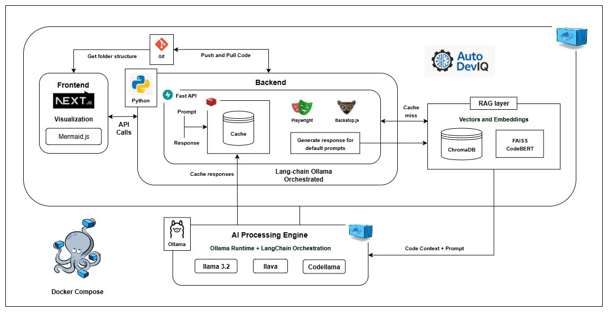
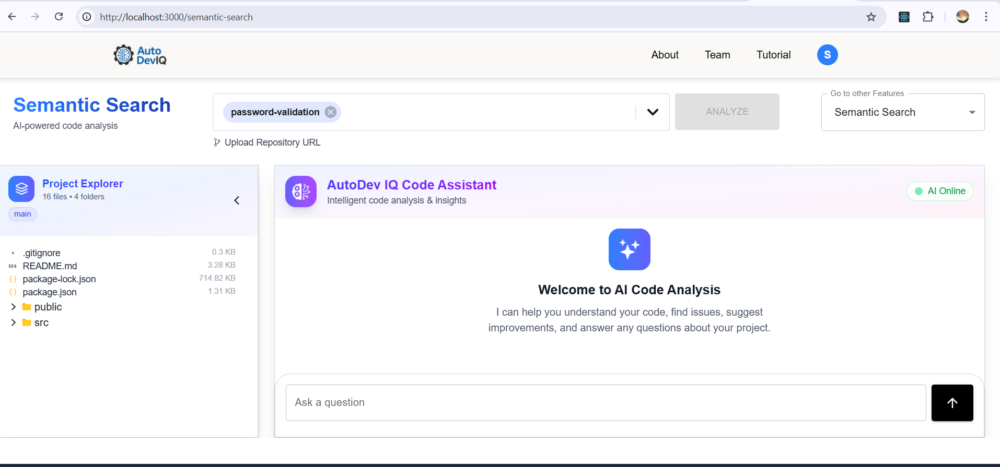
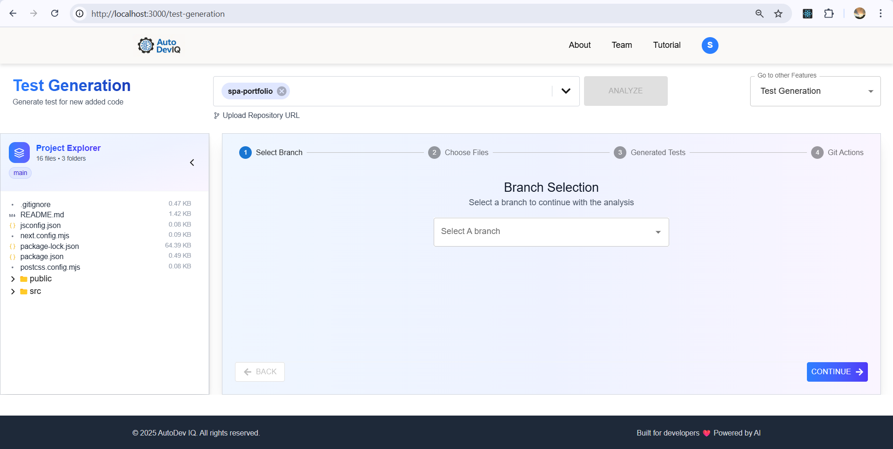
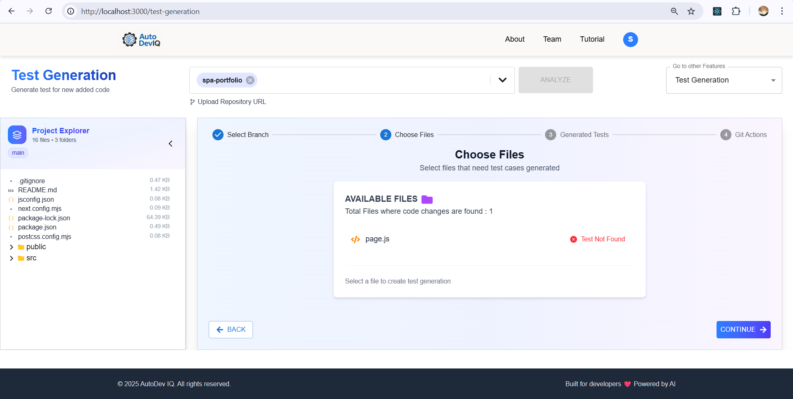
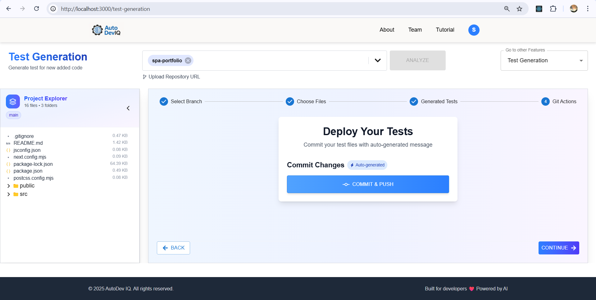
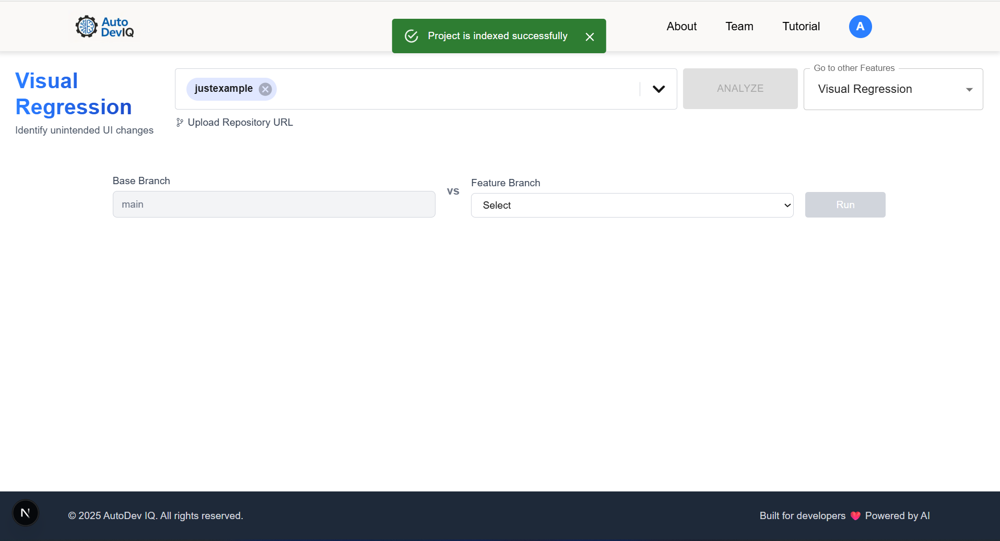
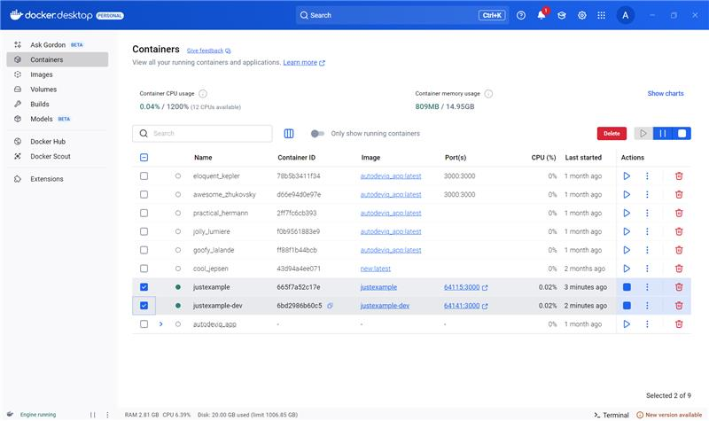
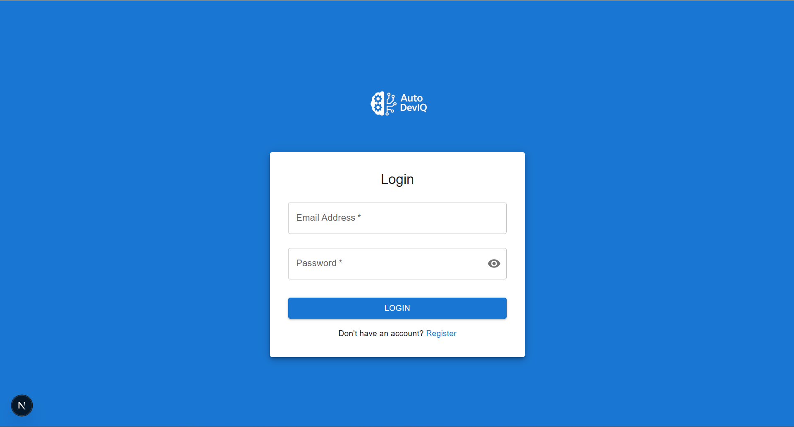
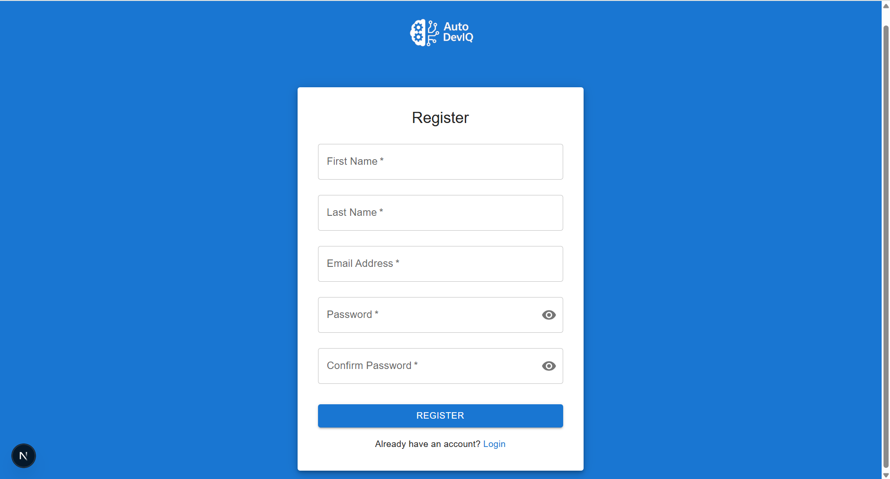

# 🚀 AutoDev IQ

**AutoDev IQ** is an AI-powered developer assistant that enables natural language interaction with your codebase. It helps developers explore, understand, and test code with ease — all from a single conversational interface.

---

## 🎯 Main Features

- 🔍 **Natural Language Code Search**  
  Ask questions like “Where is payment processing implemented?” or “How does the login flow work?”

- 🧠 **Code Flow Diagram Generation**  
  Automatically generate Mermaid diagrams for services, API flows, or component logic.

- 🧪 **Unit Test Generation**  
  Create unit tests for React components and Java classes using local LLMs.

- 📤 **Automated Commit & Push for Generated Tests**
  Automatically commit newly generated test files to your repository and push them to the remote branch without manual intervention.

- 💻 **UI Test Automation**
  Generate Playwright test scripts for form inputs, button clicks, and flows.

- 🖼 **Visual Regression Testing**
  Detect UI layout drift using Percy snapshot testing.

---

## 📦 Tech Stack

| Layer            | Tools / Frameworks                                        |
| ---------------- | --------------------------------------------------------- |
| Frontend         | Next.js, Material UI,React Icons, Framer Motions, Mermaid |
| Backend API      | Node.js, Python,FastAPI, Lanchain                         |
| LLM Interface    | Local model via Ollama - lama3.2, llava                   |
| Embedding Engine | FAISS, Transformers (CodeBERT, MiniLM)                    |
| UI Testing       | Playwright, backstopjs                                    |
| Diagram Engine   | Mermaid.js (LLM-generated syntax)                         |
| Containerization | Docker, Docker Compose                                    |
---

## 🎪 Architecture


---

## 📂 Project Structure

```
# Frotend
autodeviq_app/
├── public/                      # Static assets

├── src/
│ ├── app/                       # Next.js routes & layouts
│ │ ├── about/                   # About page
│ │ ├── login/                   # Login page
│ │ ├── register/                # Registration page
│ │ ├── semantic-search/         # Semantic search route
│ │ │ ├── layout.js
│ │ │ └── page.js
│ │ ├── layout.js                # Root layout
│ │ └── page.js                  # Home page

│ ├── components/                # Reusable UI components
│ ├── context/                   # Each Page React context
│ ├── reusables/                 # Shared smaller components
│ └── utils/                     # Helper functions

├── .env.local
├── Dockerfile                   # Docker file to run frontend folder
└── package.json
```

```
#Backend
├── app/                                   # Core backend application
│ ├── init.py
│ ├── background_qa_generator.py
│ ├── dom.py

├── indexed_projects/                      # Indexed project data
├── prompts/                               # Prompt templates
├── qa_cache_storage/                      # QA cache storage

├── AutoDevIQ.postman_collection.json      # Postman API collection
├── babelParser.js                         # Babel parser for JS/React files
├── config.py                              # Application configuration
├── Dockerfile                             # Docker container setup
├── main.py                                # Entry point for backend

├── requirements.txt                       # Python dependencies
└── README.md

```
---

## 🚀 Getting Started

### Prerequisites

- Node.js (v18+)
- Python (v3.8+)
- Docker & Docker Compose
- Ollama (for local LLM inference)

### Installation

1. **Clone the repository**

   ```bash
   git clone https://github.com/IN-Valtech/AutoDevIQ.git
   cd source_base
   ```

2. **Set up the environment**

   ```bash
   # Install frontend dependencies
   cd autodeviq_app
   npm install

   # Install Python dependencies
   cd AutoDev_IQ_BE
   pip install -r requirements.txt

   # Run docker in desktop
   ```


3. **Configure Ollama**

   ```bash
   # Pull required models
   ollama pull llama3.2:latest
   ollama run llama3.2:latest
   ```

4. **Start the application**

   ```bash
   # Using Docker Compose to run in Docker
   cd source_base
   docker-compose up -d

   # Or run manually in your local system
   # Frontend
   cd autodeviq_app
   npm run build
   npm run start

   # Backend
   cd AutoDev_IQ_BE
   npm install @babel/core @babel/parser @babel/traverse
   python -m uvicorn main:app --reload
   ```

5. **Access the application**
   - Frontend: `http://localhost:3000`
   - Backend API: `http://localhost:8000`

## 💡 Usage Examples

### Semantic Search
**Semantic Search Landing Page**


**Existing Indexed projects OR Upload a New Repository**


**Project folder structure of the main branch and Chat option with AI**


**Response from AI for asked question, Also code is shown**


**Flow chart diagram using mermaid**


### Test Generation
**Test Generation Landing Page**


 **After project selection, option to select other branches to compare & folder structure**


 **Detected files where test cases is missing**


 **Generated Test case file**


 **Commit and Push Option**


 **Committed Files in project Repo, with commit Details**


### Visual Regression

 **Landing Page for Visual Regression**


 **Indexed projects with branch selection Options**


 **Visual Images and AI Output**


 **Running Base and Feature branch in docker**



### Login/Registration

 **Login Page**


 **Registration Page**

